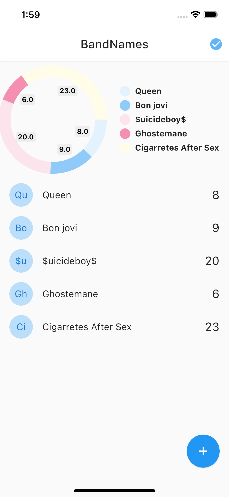

# Flutter Avanzado: Lleva tu conocimiento al siguiente nivel

Udemy curse by: [Fernando Herrera](https://fernando-herrera.com/#/)

## Bands App
Bands App you can add vote or delete bands, working with NodeJS (socket.io), MongoDB, etc.

Server working with [Bands App](https://github.com/JimHuertas/01-bands-names-server)

MODULES: 
- 1(intro)&ensp; ✅
- 2&emsp;&emsp;&emsp;&ensp;✅
- 3&emsp;&emsp;&emsp;&ensp;✅
- 4&emsp;&emsp;&emsp;&ensp;✅
- 5&emsp;&emsp;&emsp;&ensp;✅

Next Modules:
[Messenger App](https://github.com/JimHuertas/messenger_app_flutter)

 

# Feedback

Learning backend with NodeJS in Flutter.
Requirements:
- Flutter (this project)
- Postman (test requests)
- MongoDB Compass (not used in this app but the project)
- NodeJS (nodemon: 'sudo npm i -g nodemon' )
## Modules 

### 01 - Band Names

#### YAML Flutter:
- cupertino_icons: ^1.0.2 (views for IOS)
- socket_io_client: ^2.0.0
- provider: ^6.0.3 (listeners for changes in real time on views)
- pie_chart: ^5.3.2 (Pie Chart Widget with cool animation)